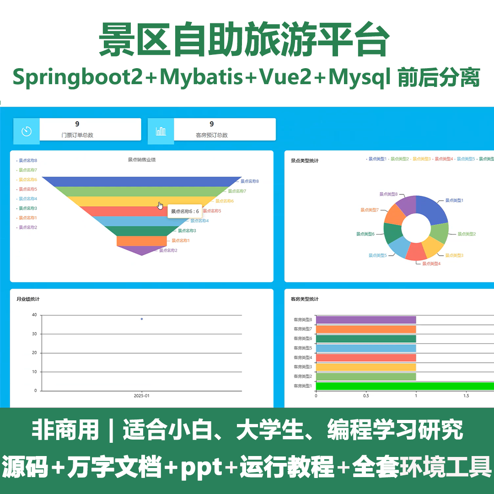
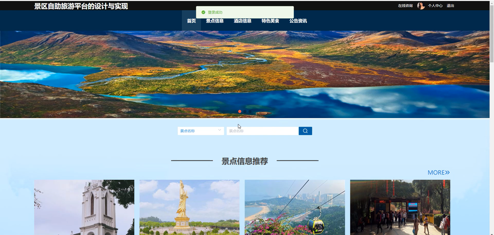
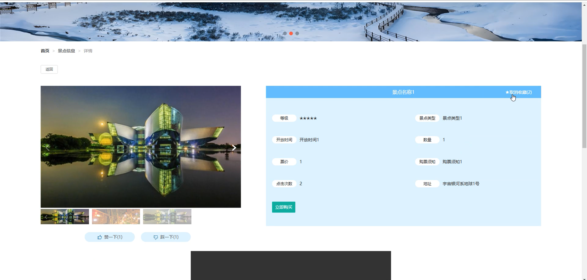
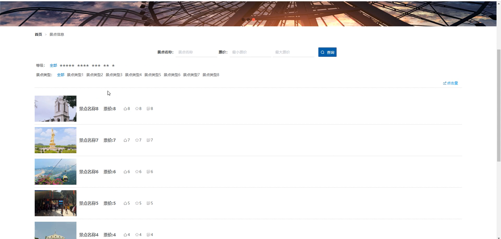
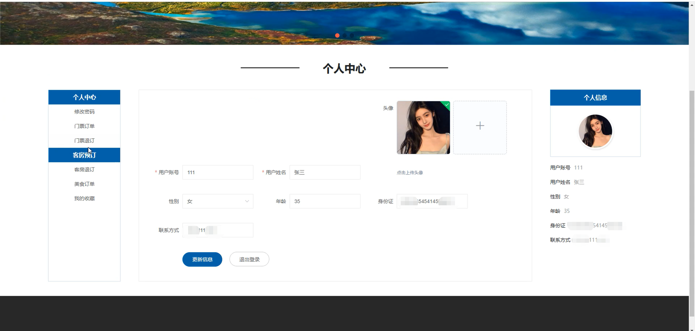
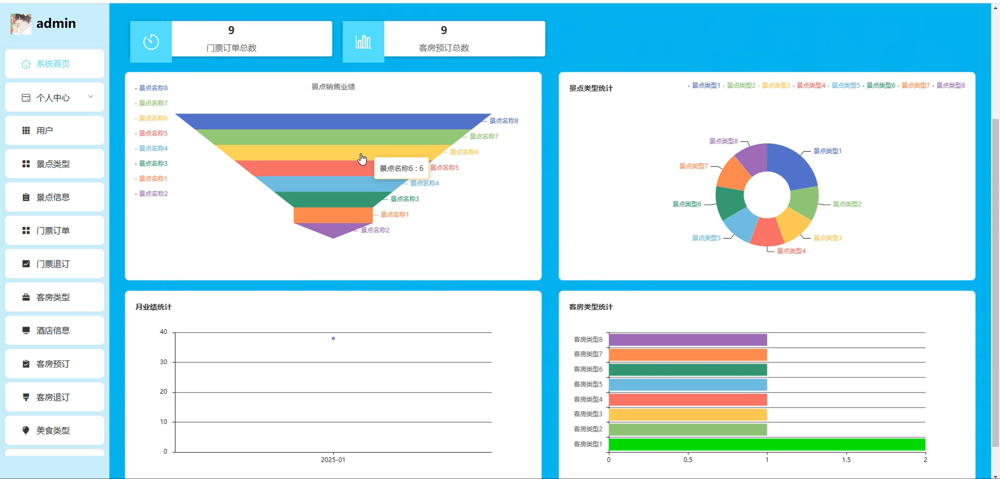
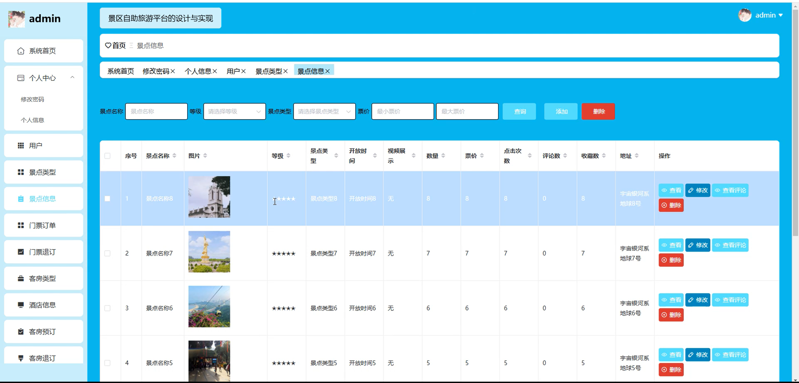
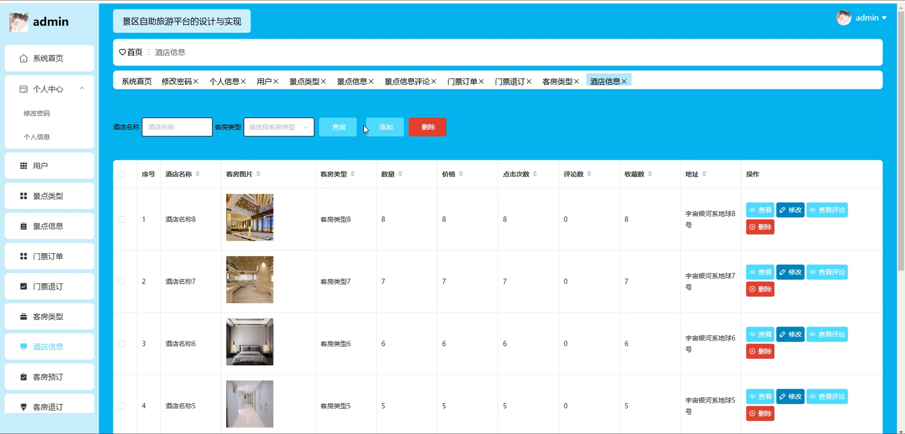
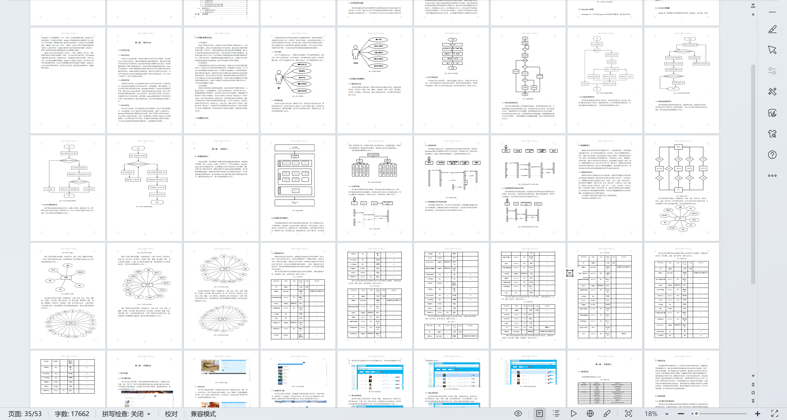

# springbootA445D
springbootA445D景区自助旅游平台+LW+PPT
 
## 查看主页获取源码

### 一、关键词
景点信息、门票订单、门票退订

### 二、作品包含
源码+数据库+设计文档万字+ppt+全套环境和工具资源+本地部署教程

### 三、项目技术
前端技术：Html、Css、Js、Vue2.0、Element-ui 
后端技术：Java、SpringBoot2.0、MyBatis

### 四、运行环境（以下版本亲测，其他版本未知，请自测）
开发工具：IDEA/eclipse  + VSCODE

数据库：MySQL5.7（最低要5.7版本）

数据库管理工具：Navicat10以上版本

环境配置软件： JDK1.8 + Maven3.6.3

前端Nodejs：14

浏览器：谷歌浏览器

### 五、项目介绍
项目编号：springbootA445D

景区自助旅游平台可为游客提供景点信息，订单及系统进行全面管理，实现游客自助游与平台高效运营的双向需求。

角色：管理员、用户

用户功能：首页、景点信息、酒店信息、特色美食、公告资讯、个人中心、修改密码、门票订单、门票退订、客房预订、客房退订、美食订单、我的收藏。

管理员功能：系统首页、个人中心、用户、景点类型、景点信息、门票订单、门票退订、客房类型、酒店信息、客房预订、客房退订、美食类型、特色美食、美食订单、系统管理。

### 六、运行截图

